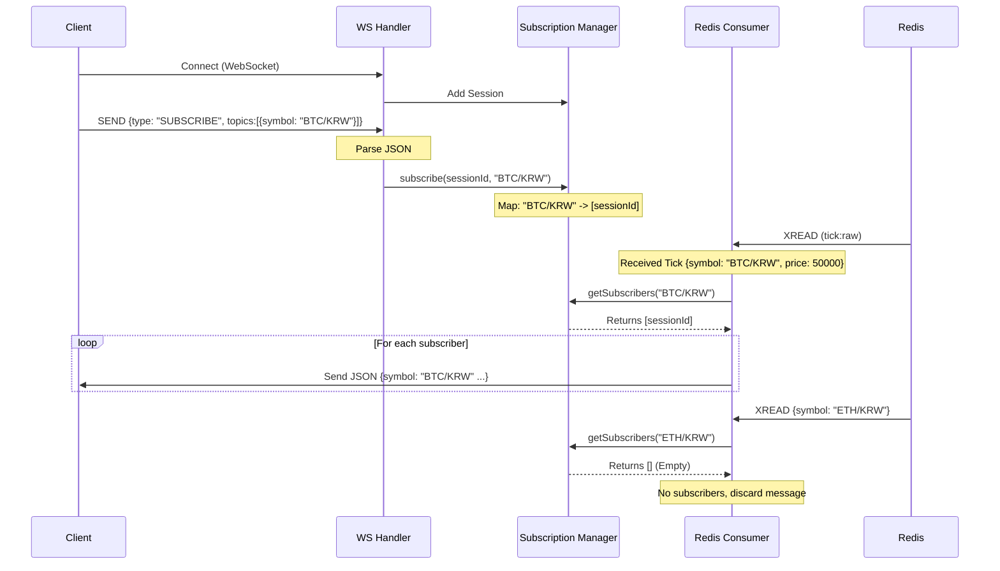

# WebSocket Subscription Protocol Definition

Defined and implemented the WebSocket message protocol to allow clients to subscribe to specific cryptocurrency symbols and receive real-time updates.

## 구체적인 작업 내용

1.  **프로토콜 정의 (`WsRequest`, `WsCommandType`)**
    *   클라이언트가 서버로 보낼 메시지 포맷을 정의했습니다.
    *   **SUBSCRIBE**: 특정 암호화폐(Symbol)의 데이터 수신을 요청
    *   **UNSUBSCRIBE**: 데이터 수신 중단 요청
    *   **JSON 예시**:
        ```json
        {
          "type": "SUBSCRIBE",
          "topics": [
            { "symbol": "BTC/KRW" }
          ]
        }
        ```

2.  **구독 상태 관리 (`SubscriptionSessionManager`)**
    *   **양방향 매핑**: `SessionId <-> Symbol` 관계를 메모리(`ConcurrentHashMap`)에 저장하여 효율적인 조회가 가능합니다.
    *   **자동 정리**: 웹소켓 연결이 끊어지면(`afterConnectionClosed`), 해당 세션의 모든 구독 정보를 자동으로 삭제하여 메모리 누수를 방지했습니다.

3.  **핸들러 및 컨슈머 연동**
    *   **WebSocket Handler**: 클라이언트의 JSON 메시지를 파싱하여 `SUBSCRIBE`/`UNSUBSCRIBE` 명령을 처리합니다. 가독성을 위해 `if-else` 분기 처리 및 메서드 추출(`handleSubscribe`, `handleUnsubscribe`)을 적용했습니다.
    *   **Redis Stream Consumer**: Redis에서 수신한 `tick:raw` 메시지의 `symbol`을 확인하고, **실제 구독 중인 세션에게만** 데이터를 전송하도록 필터링 로직을 구현했습니다.

4.  **검증**
    *   Python 스크립트를 사용하여 클라이언트 구독 시나리오(SUBSCRIBE -> Redis Data Injection -> Receive)를 성공적으로 검증했습니다.
    *   구독하지 않은 심볼의 데이터는 수신되지 않음을 확인했습니다.

## 🔄 Logical Flow & Architecture

The following diagram illustrates how a Client subscribes to a topic and receives data.

### Sequence Diagram



### Class Roles
1.  **`CoinflowWebSocketHandler`**: 입구(Entry point). 클라이언트의 요청(`SUBSCRIBE`)을 해석하고 매니저에게 등록을 위임합니다.
2.  **`SubscriptionSessionManager`**: 저장소(Registry). "누가(Session) 무엇을(Symbol) 보고 있는지"를 메모리에 관리합니다. `ConcurrentHashMap`을 사용하여 `Symbol ->  Set<SessionId>` 조회가 즉각적으로 가능합니다.
3.  **`TickRawStreamConsumer`**: 배달부(Courier). Redis에서 물건(Tick)을 가져오면, 매니저에게 "이거 볼 사람 누구니?" 물어보고, 명단에 있는 사람에게만 배달합니다.
