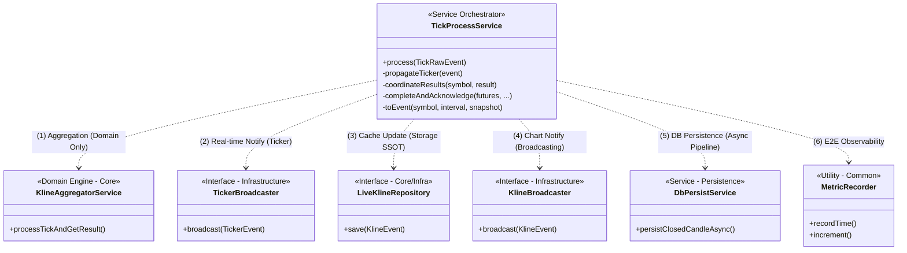
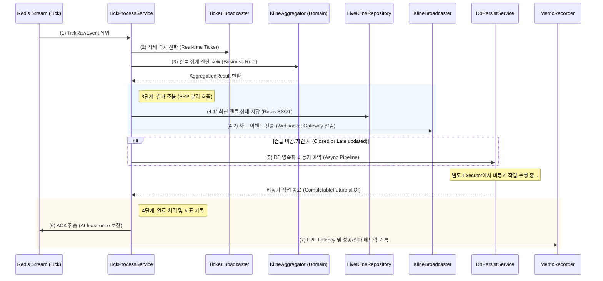
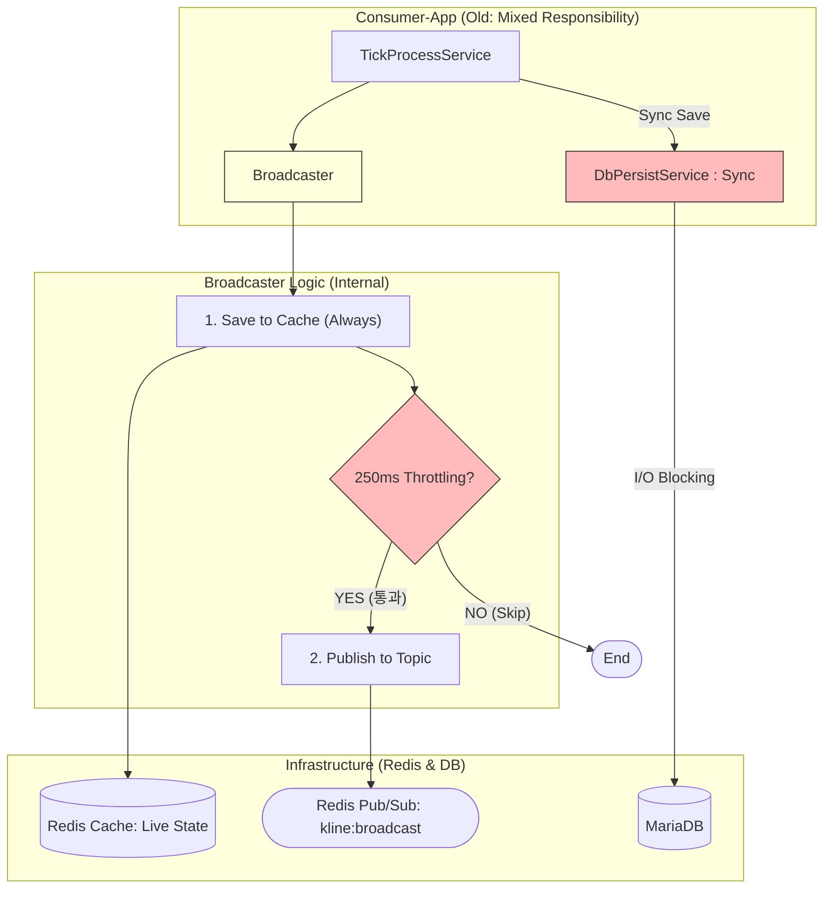
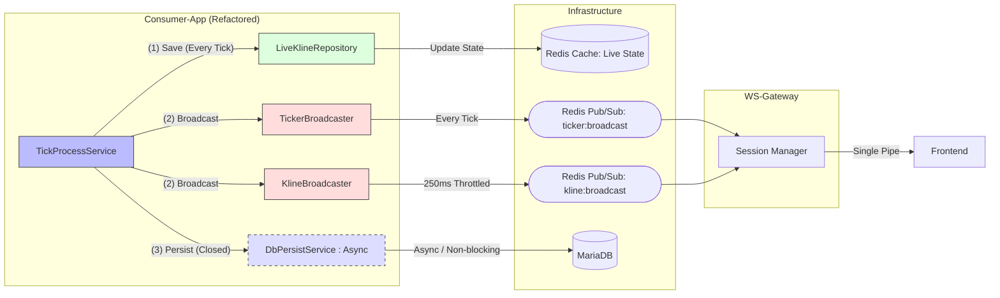

# #81 [FEAT] aggregate 최적화 작업 진행 보고
 
본 문서는 `coinflow-consumer-app` 모듈의 `com.coinflow.aggregation` 패키지 리팩토링 및 최적화 작업에 대한 최종 아키텍처와 틱 처리 흐름을 정의합니다.
 
---
 
## 📊 1. Consumer 틱 처리 아키텍처
 
### 1.1 클래스 상관관계 (Class Diagram)
각 계층(Domain-Service-Infrastructure)이 어떻게 협력하여 고성능 처리를 수행하는지 나타냅니다.
 

 
### 1.2 실시간 틱 처리 흐름 (Sequence Diagram)
하나의 틱(`TickRawEvent`)이 유입되었을 때 처리되는 시간 순서와 비동기 조율 과정을 나타냅니다.
 

 
---
 
## 💡 2. 최적화 및 설계 핵심 포인트 (Core Values)
 
### 2.1 SRP (단일 책임 원칙) 기반 인프라 분리
*   **Storage(상태) vs Notification(알림)**:기존에는 브로드캐스터가 저장까지 담당했으나, 리팩토링 후 `LiveKlineRepository`(캐시 저장)와 `Broadcaster`(전송)로 책임을 명확히 분리했습니다.
*   **조율자(Orchestrator) 도입**: `TickProcessService`가 각 기능의 실행 순서를 제어하여 비즈니스 가독성을 높였습니다.
 
### 2.2 지연 시간 최소화 (Low Latency)
*   **시세 전파 우선 순위**: 복잡한 집계 로직 수행 전, 현재가 정보(`Ticker`)를 최우선으로 전송하여 사용자의 체감 응답 속도를 극대화했습니다.
*   **비동기 영속화 파이프라인**: 상대적으로 느린 DB I/O를 메인 처리 스레드에서 분리하여 틱 처리 성능을 보장합니다.
 
### 2.3 관측 가능성 (Observability)
*   **E2E Latency 측정**: `StopWatch` 기반으로 틱 유입부터 최종 처리 완료(ACK)까지의 전체 소요 시간을 측정하여 운영 지표로 활용합니다.
*   **실패 전략 (Resilience)**: 비동기 작업 실패 시 ACK를 보내지 않아 데이터 손실을 방지하고, 실패 태그를 메트릭에 남겨 즉각적인 대응이 가능하도록 설계했습니다.
 
### 2.4 테스트 표준화
*   **Given-When-Then 패턴**: 모든 테스트 코드를 G-W-T 구조로 재정리하여 가독성을 높이고 비즈니스 명세를 명확히 했습니다.
*   **정밀도 검증**: `VolumeScaler` 등을 활용하여 대용량 금융 데이터 처리 시의 정밀도 손실 문제를 원천 차단했습니다.
 
---
 
## ⚖️ 3. 리팩토링 전후 구조 비교 (Before vs After)
 
백엔드의 **구조적 분리(Decoupling)**가 프론트엔드의 **단일 웹소켓 연결(Single Connection)**을 해치지 않으면서 안정성을 높인 핵심 변화입니다.
 
### 3.1 변경 전 (Single Mixed Path & Orchestration Lack)
*   **특징**: `Broadcaster`라는 단일 인프라 클래스가 저장(Save)과 전파(Publish)의 실행 순서를 내부적으로 결정했습니다.
*   **구조적 한계**: 비즈니스 흐름(저장 후 전파)이 서비스 계층이 아닌 인프라 클래스(`Broadcaster`) 내부에 하드코딩되어 있었습니다. 이로 인해 서비스 계층에서 전송 타이밍이나 특정 조건(예: 특정 종목 제외 등)을 제어하기 어렵고, 한 메서드에 여러 책임이 섞여 있는 **SRP 위반 구조**였습니다. 또한, **DB 영속화 로직이 동기식(Synchronous)**으로 처리되어 RDBMS I/O 대기 시간이 틱 처리 전체의 병목(Bottleneck)으로 작용했습니다.
 

 
### 3.2 변경 후 (Specialized Paths & Service Orchestration)
*   **특징**: `TickProcessService`가 전체 실행 흐름을 주도하며, 인프라 클래스들은 각각 상호 독립적인 전문 기능을 수행합니다.
*   **흐름**: 
    1.  **(Orchestration)**: 서비스 계층에서 **저장(State), 전파(Event), 영속화(DB)**의 선후 관계를 직접 제어합니다.
    2.  **(Specialization)**: 시세(`Ticker`)와 차트(`Kline`) 도로를 완전히 분리하여 각각 최적의 주기로 전송합니다.
    3.  **(Asynchronous)**: 가장 느린 **DB 영속화(MariaDB)**를 비동기식(Async)으로 격리하여 틱 처리 파이프라인의 I/O 병목을 제거했습니다.
 

 
### 3.3 프론트엔드 영향도 분석 (Why it works?)
프론트엔드 입장에서 **웹소켓 엔드포인트는 여전히 하나**이지만, 백엔드로부터 다음과 같은 이점을 얻습니다:
*   **독립적 데이터 수신**: 시세가 변할 때와 차트가 변할 때 각각 별개의 JSON 메시지를 받으므로, 화면의 현재가 숫자와 차트 캔들을 각각 독립적인 상태로 업데이트하기에 훨씬 유리한 구조가 되었습니다.
*   **안정적 연결**: 게이트웨이가 여러 토픽의 메시지를 큐잉하고 병합하므로, 백엔드의 데이터 공급원이 늘어나도 프론트엔드의 연결 로직을 변경할 필요가 없습니다.
 
### 3.4 데이터 종류별 전송 타이밍 (Timing Reference)
 
| 데이터 구분 | 전송 주기 (Timing) | 실시간성 | 용도 및 비고 |
| :--- | :--- | :--- | :--- |
| **현재가(Ticker)** | **매 틱 (Every Tick)** | **최상** (즉시) | 실시간 호가 및 체결가 표시 (지연 없음) |
| **캐시(Redis Cache)** | **매 틱 (Every Tick)** | **최상** (즉시) | 차트 초기 진입 데이터 제공용 (SSOT 확보) |
| **진행중 캔들(Live)** | **최소 250ms 간격** | **상** (쓰로틀링) | 차트 실시간 캔들 움직임 (부하 방지용) |
| **마감 캔들(Closed)** | **즉시 (Immediately)** | **최상** (즉시) | 차트 캔들 확정 (정확성이 중요하므로 즉시 전송) |
 
> [!NOTE]
> **이전 버전에서 Redis Cache 전파가 모호했던 이유**
> 과거 버전은 `broadcastAndSave` 메서드 하나가 `put(Cache)`과 `send(Topic)`을 원자적으로 수행하려다 보니, 특정 상황(예: 마감 전 라이브 틱)에서 캐시 업데이트만 되고 전파가 누락되거나 혹은 그 반대의 상황이 발생해도 제어가 어려웠습니다. 현재는 **모든 틱에 대해 무조건 캐싱(Action A)을 먼저 수행한 뒤, 성격에 맞는 통로(Action B, C)로 전파**하는 구조를 강제하여 데이터 유실 없는 전용 경로를 확보했습니다.
 

