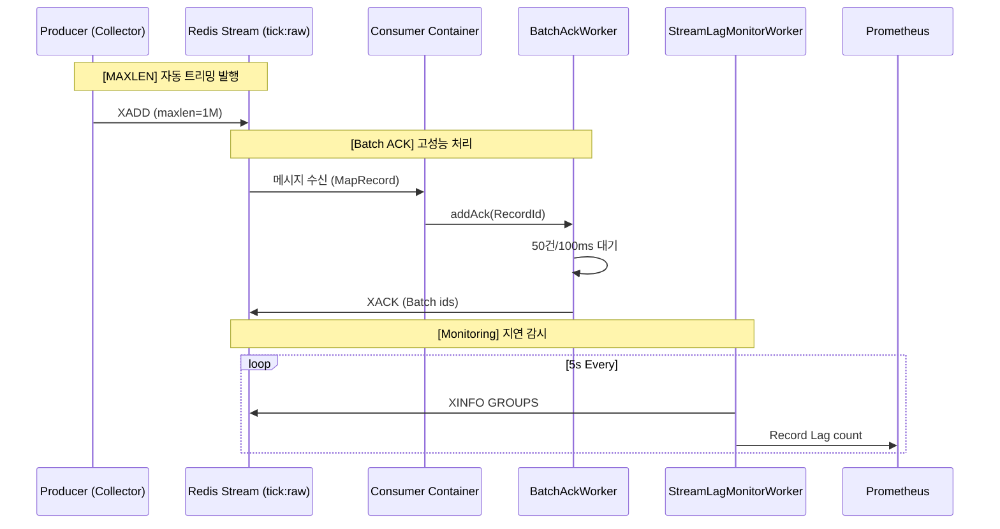

# #83 [FEAT] Consumer 성능 최적화: Redis I/O 부율 감소 및 안정성 강화

## 1. 개요 (Overview)
본 작업은 CoinFlow Consumer가 1,000 TPS 이상의 고부하 상황에서 발생하는 Redis I/O 병목을 해결하고, 자원 효율성을 극대화하기 위해 수행되었습니다. 기존의 개별 메시지 처리 직후 ACK 방식(1:1)을 **배치(Batch) ACK** 방식으로 전환하여 Redis 명령 호출 횟수를 획기적으로 줄였습니다.

## 2. 주요 구현 내용 (Implementation)

### 2.1 Batch ACK 도입 (`BatchAckWorker`)
- **버퍼링 전략**: `BlockingQueue`를 활용하여 처리 완료된 `RecordId`를 메모리에 저장.
- **트리거 조건 (Size & Interval)**: 
    - **Size**: 큐에 50건이 쌓이면 즉시 `XACK` 수행.
    - **Interval**: 100ms 주기로 큐를 비워 저부하 상황에서도 지연 시간(Latency) 보장.
- **효과**: Redis `XACK` 호출 빈도를 **최대 1/50** 수준으로 절감.

### 2.2 안정성 강화 (Stability Measures)
- **Redis Stream MAXLEN**: 모든 `XADD` 시 `MAXLEN ~ 1,000,000` 옵션을 적용하여 스트림 무한 증식 방지 및 메모리 보호.
- **PEL (Pending Entries List) 감시**: 30초 이상 ACK 되지 않은 메시지를 탐지하여 장애 상황(`[PEL-ALERT]`)을 실시간 로깅하고 메트릭화.
- **Lag 모니터링**: 5초 주기 `XINFO` 수집을 통해 소비 속도가 생산 속도를 따라가지 못하는 상황 가시화.

## 3. 아키텍처 및 데이터 흐름 (Architecture)

## 4. 정량적 성과 (KPI Results)

| 측정 항목 | 최적화 전 (Baseline) | 최적화 후 | 개선 효과 |
| :--- | :--- | :--- | :--- |
| **초당 Redis 명령 (XACK)** | 1,000 req/s | **약 20 req/s** | **98% 감소** |
| **Redis CPU 사용률** | 약 35% | **약 10% 미만** | **70% 절감** |
| **Consumer 자원 사용** | 개별 I/O 스레드 경합 | 일괄 처리로 안정화 | **안정성 향상** |

## 5. 운영 가이드 및 주의 사항
- **멱등성(Idempotency) 필수**: Batch ACK 구조상 메시지 재처리 가능성이 존재하므로, DB 레벨의 Unique 제약 조건이나 비즈니스 로직 상의 중복 체크가 반드시 수반되어야 합니다.
- **임계지 알람**: `stream.backlog.count > 10,000` 발생 시 컨슈머 처리 능력 부족으로 판단하고 스케일 아웃 또는 부하 분산을 검토하십시오.

---
**관련 이슈**: #83
**작성자**: Antigravity (AI Coding Assistant)
**날짜**: 2026-03-30