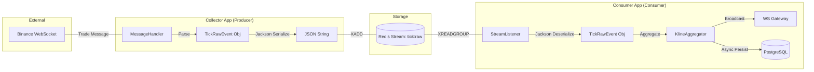
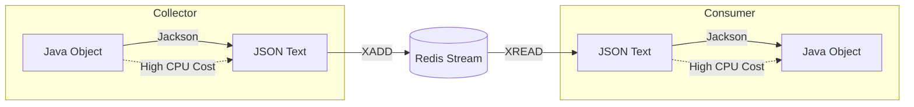
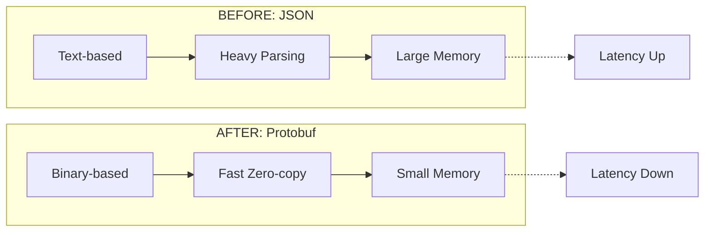

# 현재 Consumer 모듈 데이터 흐름 구조

현재 시스템은 **Collector(생산자)**와 **Consumer(소비자)**가 분리되어 있으며, 데이터는 Redis Stream을 통해 비동기로 전달됩니다.



---

# Serialization 최적화 계획

## 현재 구조 Serialization 이루어지는 부분

현재 구조에서 **CPU 소모가 가장 큰 지점**은 데이터가 네트워크를 넘나들 때 발생하는 Jackson 직렬화/역직렬화입니다.



## 현재 데이터 저장 구조 및 문제점

- **포맷**: JSON (String 기반)
- **페이로드 예시**:
  ```json
  {"symbol":"btcusdt","price":"65000.5","quantity":"0.01","eventTime":1711340000000}
  ```
- **문제점**: 
    1. **중복 필드명**: "symbol", "price" 등 키(Key)값이 매 틱마다 반복 저장되어 메모리 점유율 상승.
    2. **T2.micro 제약**: 제한된 vCPU 환경에서 텍스트 파싱은 스레드 차단을 유발하여 P99 지연시간을 악화시킴.

## 최적화 방안 (Protobuf 전환)

Google의 Protobuf를 도입하여 전 과정을 **바이너리(Binary)**로 전환합니다.



1. **스키마 기반**: 사전에 정의된 `.proto` 스키마를 사용하여 필드명 없이 값만 전송.
2. **이진 압축**: 숫자를 텍스트가 아닌 정수/부동소수점 바이너리로 저장하여 크기를 50% 이상 축소.
3. **P99 지연시간 방어**: 역직렬화 속도 향상을 통해 T2.micro에서도 50ms 미만의 처리 속도 확보.

## 테스트 방안

최적화 전후의 성능 차이를 수치(Data-driven)로 입증하기 위해 다음 테스트를 수행합니다.

### AS-IS 테스트 방법 (현재 JSON 구조)

1.  **페이로드 크기 측정**: Redis CLI(`MEMORY USAGE`)를 통해 현재 JSON으로 저장된 틱 데이터 1건당 평균 바이트 수 측정.
2.  **직렬화 오버헤드 측정**: `StopWatch`를 활용하여 `TickRawEvent` ➔ JSON 문자열로 변환하는 데 소요되는 **평균 CPU 시간(ms)** 기록.
3.  **지표 수집 (Baseline)**: 100개 종목 부하 상황에서 현재의 `TICK_PROCESS_LATENCY (P99)` 및 `Consumer CPU Usage(%)`를 그라파나에서 1시간 동안 관측.

### TO-BE 테스트 방법 (Protobuf 전환 후)

1.  **데이터 압축률 비교**: 동일한 틱 데이터를 Protobuf로 저장했을 때의 메모리 점유율을 측정하여 **50% 이상 감소** 여부 확인.
2.  **나노초(ns) 단위 성능 벤치마킹**: JMH(Java Microbenchmark Harness) 또는 간단한 루프 테스트를 통해 Jackson vs Protobuf의 (역)직렬화 속도 차이 정밀 측정.
3.  **한계 부하 테스트 (Stress Test)**: 
    - 초당 틱 유입량을 점진적으로 늘려가며(예: 1k ➔ 5k ➔ 10k TPS), T2.micro 환경에서 **CPU 지연 없이 처리가 가능한 최대 임계점** 확인.
    - 지연 발생 시 P99 Latency가 50ms 미만으로 유지되는지 최종 검증.
4.  **역호환성 테스트**: Collector만 Protobuf로 배포했을 때 Consumer에서 에러가 발생하는지(정상 실패), 두 모듈 동시 배포 시 데이터가 깨짐 없이 DB에 저장되는지 확인.
