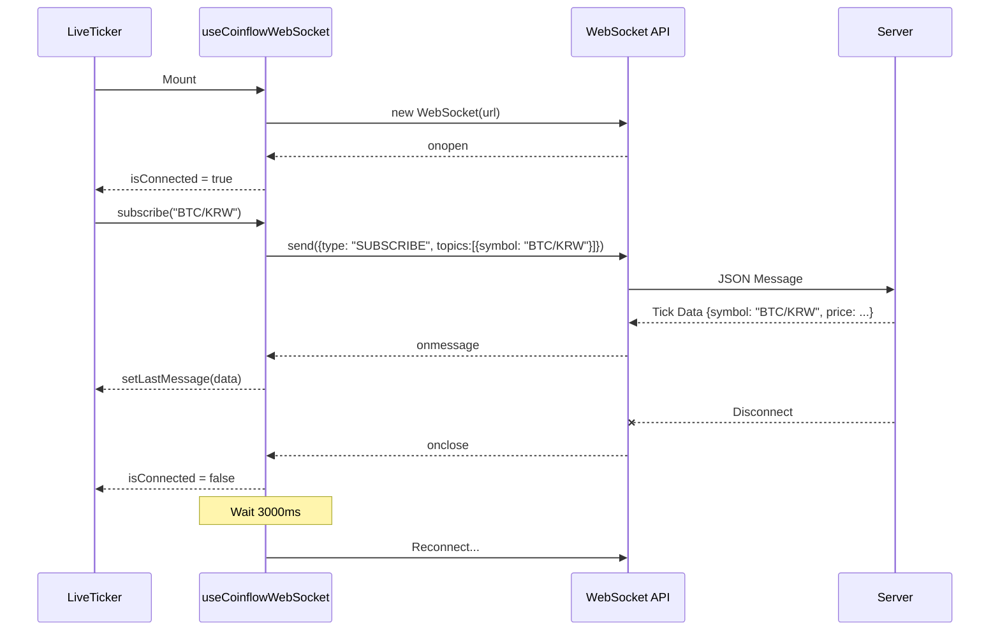

# WebSocket Hook Implementation

Implemented a custom React hook `useCoinflowWebSocket` to manage WebSocket connections, handle subscription lifecycles, and provide real-time data to components.

## 구체적인 작업 내용

1.  **WebSocket 연결 관리 (`useCoinflowWebSocket`)**
    *   **자동 연결 및 재연결**: 컴포넌트 마운트 시 자동으로 연결을 시도하며, 연결이 끊어질 경우 3초(`RECONNECT_INTERVAL`) 후 자동으로 재연결을 시도합니다.
    *   **상태 관리**: `isConnected` 상태와 수신된 마지막 메시지(`lastMessage`)를 React State로 관리하여 UI에 실시간으로 반영됩니다.
    *   **리소스 정리**: 컴포넌트 언마운트 시 WebSocket 연결을 종료하고 타이머를 해제하여 메모리 누수를 방지했습니다.

2.  **구독 및 메시지 전송**
    *   **subscribe/unsubscribe**: 특정 코인 심볼에 대한 구독 요청을 전송하는 함수를 제공합니다.
    *   **JSON 프로토콜 준수**: 백엔드와 정의된 프로토콜(`WsRequest`, `WsCommandType`)에 맞춰 JSON 형식으로 메시지를 직렬화하여 전송합니다.

3.  **이슈 해결 및 최적화**
    *   **verbatimModuleSyntax 호환성**: `WsRequest`, `TickData` 등 타입 전용 import를 명시적으로 분리(`import type ...`)하여 TypeScript 컴파일 에러를 해결했습니다.
    *   **순환 참조 해결**: `connect` 함수 내부에서 자신을 참조하는 재귀적 로직을 `useRef`를 사용하여 안전하게 구현, `access before declaration` 에러를 방지했습니다.

## 🔄 Logical Flow

### Component Integration Flow



### Hook Interface

```typescript
const { 
    isConnected, // Connection status (boolean)
    lastMessage, // Latest tick data (TickData | null)
    subscribe,   // Function to subscribe to a symbol
    unsubscribe  // Function to unsubscribe
} = useCoinflowWebSocket(WS_URL);
```
