# Real-time Chart UI/UX Improvements

Improved the trading chart component to support real-time updates, separated scale layouts, and responsive design using Lightweight Charts v5.

## 구체적인 작업 내용

1. **Lightweight Charts v5 마이그레이션 및 적용**
    - 라이브러리 버전을 v5로 업데이트하고, 변경된 API(`addSeries` generic pattern)에 맞춰 구현을 수정했습니다.
    - `ResizeObserver`를 도입하여 부모 컨테이너 크기에 맞춰 차트가 반응형으로 꽉 차게(100%) 렌더링되도록 개선했습니다.

2. **차트 레이아웃 및 시각적 개선 (Visual Refactoring)**
    - **거래량(Volume) 분리**: 가격(Price)과 거래량(Volume)이 겹쳐서 시인성이 떨어지는 문제를 해결하기 위해, 단일 차트 내 Overlay 방식 대신 **2개의 독립된 Chart 인스턴스**를 생성하여 상하로 배치하는 **Split View** 방식을 적용했습니다.
        - 상단(Top): 캔들스틱 차트 (가격 심볼 영역)
        - 하단(Bottom): 히스토그램 차트 (거래량 영역)
    - **Toolbar 추가**: 차트 상단에 시간 설정(1m, 15m 등) 버튼과 도구 아이콘(설정, 카메라 등)이 포함된 툴바를 구현하여 UI 완성도를 높였습니다.
    - **Y축 정렬 (Grid Alignment)**: 가격 데이터 텍스트 길이 차이로 인해 상/하단 차트의 세로 그리드 선이 어긋나는 문제를 해결하기 위해, `rightPriceScale.minimumWidth`를 **100px**로 강제 고정하여 두 차트의 캔버스 영역이 정확히 일치하도록 했습니다.

3. **고급 인터랙션 구현 (Synchronization)**
    - **Crosshair Sync (커서 동기화)**: 사용자가 상단(가격) 차트의 특정 지점을 확인할 때 하단(거래량) 차트의 동일 시간대에도 크로스헤어와 날짜가 표시되도록 `subscribeCrosshairMove` 이벤트를 통해 두 차트의 커서를 동기화했습니다.
    - **Logical Range Sync (줌/스크롤 동기화)**: 두 차트가 물리적으로 분리되어 있지만 시간 축은 동일해야 하므로, `VisibleLogicalRangeChange` 이벤트를 양방향으로 바인딩하여 줌이나 스크롤 시 두 차트가 완벽하게 일치되어 움직이도록 구현했습니다.

4. **실시간 데이터 연동 (Real-time Integration)**
    - 앞서 구현한 `useCoinflowWebSocket` 훅과 연동하여 `BTCUSDT` 실시간 틱 데이터를 수신합니다.
    - **Real-time Aggregation**: 수신된 Raw Tick 데이터를 **1분 봉(Candle)** 형태로 실시간 집계하여 차트에 반영합니다.
        - **Update**: 현재 분(Minute)의 캔들이라면 High/Low/Close 가격을 갱신하고 거래량을 누적합니다.
        - **Create**: 새로운 분(Minute)이 시작되면 즉시 새로운 캔들 객체를 생성하여 차트에 추가합니다.

## 🔄 Logical Flow

### Real-time Chart Architecture

```mermaid
sequenceDiagram
    participant WS as WebSocket Hook
    participant Chart as TradingChart Component
    participant Instance as LightWeight Charts (x2)

    %% Initialization
    Chart->>Instance: Create Price Chart (Top Container)
    Chart->>Instance: Create Volume Chart (Bottom Container)
    Chart->>Instance: Bind Sync Handlers (Crosshair/Range)

    %% Real-time Updates
    WS-->>Chart: New Tick Data (Price, Qty)
    
    rect rgb(20, 20, 30)
        note right of Chart: Aggregation Logic
        Chart->>Chart: Ensure 1-minute Candle Alignment
        alt New Minute Start
            Chart->>Chart: Create New Candle Object
        else Current Minute
            Chart->>Chart: Update High/Low/Close prices
            Chart->>Chart: Accumulate Volume
        end
    end

    Chart->>Instance: MainSeries.update(CurrentCandle)
    Chart->>Instance: VolumeSeries.update(CurrentVolume)
```

