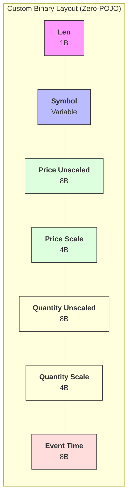

(글을 읽으시며 잘못된 부분이나 아쉬운 부분이 있다면 댓글 부탁드립니다!!)


환경: AWS T2.micro
메모리: 512MB
목표: 1분/5분/30분 캔들, 심볼(종목) 100개 확장 고려
사용자: 100명 예상


안녕하세요 오늘은 병목 지점 분석과 병목 지점중 한 부분인 직렬화 문제를 해결한 내용에 대해 이야기 해보려고 합니다.


일단 설명드리기에 앞서, Tick 데이터 데이터 흐름을 간단히 소개드리겠습니다.


흐름은 다음과 같습니다.

데이터 파이프라인 흐름(API - Collector - Consumer)
외부 API - Collector 모듈 - Consumer 모듈로 이어지는 흐름을 간단하게 나타내봤습니다.


간단하게 나타낸 데이터 파이프라인 흐름


가장 먼저, Collector 모듈이 외부 API 에서 Tick 데이터를 수집하여 Redis Stream에 추가합니다.


이후, Consumer 모듈이 해당 데이터를 처리하며 내부 인메모리에 데이터(진행중인 캔들)를 쌓고, 1. Redis에 현재 상태 갱신 2. Tick 데이터는 클라이언트로 브로드캐스팅 3. 진행중인 캔들 데이터 브로드 캐스팅 4. 마감된 캔들은 DB 저장 하는 흐름으로 이어지게 됩니다.


(왜 Redis 를 사용하였는지, Tick 과 Candle을 왜 따로 브로드캐스팅 하는지, DB 를 왜 비동기로 저장하는지는 해당 포스팅에서 다루지 않습니다.)


저는 데이터가 얼마나 빠르게 처리되는지 궁금해졌고, 메트릭을 수집하여 Grafana로 시각화 하여 모니터링을 해봤습니다.

실시간 데이터 처리 병목 지점 분석
가장 먼저, Collector - Redis Stream - Consumer 로 이어지는 전반적인 E2E Latency를 가장 먼저 측정해봤습니다.


Collector - Redis Stream - Consumer E2E Latency
(기본적으로 지표는 P95/P99/Avg 를 측정하였습니다.)


일단 어느 지표던지 제가 생각했던 것 보다 Latency가 심했고, 3개의 지표중에 어느 지표를 가장 중요하게 볼 것인지 정했습니다.

고민 끝에, 실시간성(틱 하나 밀리면 뒤에 있는 틱도 늦게 처리)이 현재 서비스에서 가장 중요하다고 판단하여 P99를 최우선으로 삼았습니다.


이후, P99 지표 모니터링을 통해 Tick 데이터 처리 과정에서 P99 latency가 비정상적으로 튀는 현상을 확인했습니다.


그래서 도대체 어느 부분에서 병목이 생겼을까.. 생각해봤습니다.


## 병목1: JSON 기반 객체 생성 ## 

가장 먼저, 떠오르는 부분이었습니다.

현재 Collector - Redis Stream - Consumer 로 이어지는 라인에서 Tick 마다 객체 생성을 진행하게됩니다.


Collector - Redis Steram - Consumer 객체 생성 모습


더 구체적으로 설명을 드려보자면,


[Collector - Redis Stream]

- JSON 파싱 (JsonNode 생성)
- DTO 객체 생성
- Map 및 String 객체 생성
- Redis 전송을 위한 직렬화


[Redis Stream - Consumer]
- Redis Stream 데이터 역직렬화 (Map > 객체 변환)
- DTO 객체 재생성
- 비즈니스 로직 처리를 위한 추가 객체 생성
- Aggregation / 가공 과정에서의 임시 객체 생성


즉, Tick 하나마다 다수의 객체가 생성되고 폐기되는 구조입니다.


실제로 JVM 메모리와 GC 지표를 분석해본 결과 다음과 같았습니다. 


[Collector 모듈]

	


[Consumer 모듈]

	


먼저 G1 Eden 영역 그래프를 보면, 사용량이 빠르게 증가한 뒤 반복적으로 초기화되는 패턴을 확인할 수 있습니다.
-> 이는 짧은 생명주기를 가진 객체가 지속적으로 생성되고, Young 영역에서 빠르게 할당되고 회수되고 있음을 의미합니다.


그리고 두 번째 Pause Drations 그래프를 확인하면 Minor GC(Young 영역에서의 GC)가 일어남을 확인할 수 있습니다.
-> Minor GC 가 일어난다는 것은 애플리케이션 스레드가 중지되는 것을 의미합니다.


따라서, 현재 T2.micro CPU 1개 환경에서 GC 로 인한 Latency가 전체 Tick 처리에 영향을 끼칠 가능성이 높다고 판단했습니다.


## 병목2: Tick 당 이루어지는 XACK 처리 ## 

두 번째 병목 지점은 Tick 단위로 수행되던 XACK 처리였습니다.

현재 구조에서는 Redis Stream에서 메시지를 하나씩 가져온 뒤, 각 Tick 처리 완료 시점마다 XACK을 수행하는 방식으로 동작하고 있었습니다.


현재 Consumer Tick 처리


즉, 다음과 같은 흐름이 반복됩니다.


[Redis Stream - Consumer]
- XREADGROUP으로 메시지 1건 조회
- Tick 처리
- XACK 수행

결과적으로 네트워크 I/O와 Redis 연산이 Tick 처리 마다 발생하는 구조가 됩니다.


실제 지표 통해 다음과 같은 사실을 확인할 수 있었습니다.


[Consumer의 TickProcessService 에서 ACK latency 측정 지표]


Consumer - Redis Stream 측정


아까 데이터 흐름에서 브로드 캐스팅 & redis 저장 & DB 저장을 수행하고 난 후 redisTemplate.opsForStream().acknowledge(...) 시점부터 Redis 서버로부터 성공(0/1)을 받기까지 측정한 결과입니다.


위에서 설명했던 흐름처럼 ACK 요청을 주고 이에 대한 응답을 받기 위해 Latency가 지속되고 있음을 알 수 있습니다.


단건 요청 자체의 비용은 크지 않더라도, Tick 단위로 ACK이 반복적으로 수행되는 구조에서 해당 latency가 누적되어 전체 처리 지연으로 이어질 수 있다는 것을 알 수 있습니다.


(++ ACK 지연이 발생할 경우 Redis Stream의 pending entry가 증가하고 consumer 가 처리해야 할 Tick이 쌓일 가능성이 존재합니다.)


물론 병목에는 수많은 원인이 존재합니다.


하지만 현재 구조에서는

- Tick마다 반복되는 객체 생성으로 인한 GC 
- Tick 단위로 수행되는 XACK 요청으로 인한 네트워크 및 Redis 호출 증가

이 두 가지가 가장 큰 비용을 발생시키고, 실시간 처리 특성 상 해당 비용이 누적되어 latency에 직접적인 영향을 미치고 있다고 판단했습니다.

따라서 위 두 가지를 주요 병목 지점으로 다뤘고, 객체 생성 최소화(Binary 전환) 및 Batch ACK 구조로 개선을 진행했습니다.


그리고 이 글에서는 객체 생성 최소화에 대한 글만 다룹니다. (Batch ACK 구조 개선은 다음 글에서 다룰 예정입니다.)

현재 객체 생성 방식과 여러 방안 비교 - 트레이드 오프
가장 먼저 현재 객체를 생성하는 방식을 살펴보겠습니다.

현재 객체 생성 방식
[ Collector - Redis Stream 으로 이어지는 과정에서의 객체 생성 방식 ]

JsonNode root = objectMapper.readTree(message);
JsonNode data = root.get(DATA);

TickRawEvent event = new TickRawEvent(
        data.get(SYMBOL).asText().toLowerCase(),
        new BigDecimal(data.get(PRICE).asText()),
        new BigDecimal(data.get(QUANTITY).asText()),
        Instant.ofEpochMilli(data.get(EVENT_TIME).asLong()),
        null // streamId는 Collector 단계에서 아직 존재하지 않음 (publish 이전)
);

publisher.publish(event);


objectMapper.readTree() 호출 시 JSON 문자열 전체를 파싱하여 트리 구조(JsonNode)를 생성하게 되며, 이 과정에서 다수의 객체가 생성됩니다. (외부 API 에서 JSON 받아오는 부분)


이후 data.get(...).asText()를 통해 필드를 추출하는 과정에서도 새로운 String 객체가 생성되며, BigDecimal, Instant 변환 과정에서도 추가적인 객체 생성이 발생합니다.


[ Redis Stream - Consumer 로 이어지는 과정에서의 객체 생성 방식 ]

# consume
public boolean handle(Map<String, String> value, String streamKey, String group, RecordId recordId) {
        try {
            TickRawEvent event = new TickRawEvent(
                    value.get(SYMBOL),
                    new BigDecimal(value.get(PRICE)),
                    new BigDecimal(value.get(QUANTITY)),
                    Instant.parse(value.get(EVENT_TIME)),
                    recordId.getValue());
            
            tickProcessService.process(event, streamKey, group, recordId);

            return true;
        } catch (Exception e) {
			~~
        }
 }
 
 # Tick 데이터 수집
 AggregationResult result = klineAggregatorService.processTickAndGetResult(
                    event.symbol(),
                    event.price(),
                    event.quantity(),
                    event.eventTime().toEpochMilli()
            );
            
# 이후 과정도 계속 변환 진행
~~~~ ...
Consumer 단계에서도 동일한 문제가 반복됩니다.


Redis Stream에서 데이터를 수신하면 Map<String, String> 형태로 전달되며, 이 자체로도 이미 여러 개의 String 객체와 Map Entry 객체가 생성된 상태입니다.


이후 다시 TickRawEvent로 변환하는 과정에서

BigDecimal 재생성
Instant 재생성
DTO 객체 생성
이 반복됩니다.


즉, Collector에서 한 번 생성한 데이터를 Consumer에서 다시 객체로 재구성하는 구조입니다.


그렇다면 이를 해결할 방안은 무엇이 있는지 살펴보겠습니다.

객체 생성 최적화 방안
앞서 살펴본 것처럼 현재 구조에서는 Collector와 Consumer 양쪽에서 Tick 데이터마다 반복적인 객체 생성이 발생하고 있습니다.


특히 지금의 구조는 단순히 객체 하나를 생성하는 것이 아니라, 여러 개의 객체를 함께 생성하게 되며 결과적으로 GC가 빈번히 발생하는 원인이 됩니다.


따라서 이러한 문제를 해결하기 위해 다음과 같은 방안을 검토했습니다.

## 1. Streaming API (Jackson JsonParser)## 
JsonNode 기반 파싱 대신 Streaming API를 사용하여 필요한 필드만 순차적으로 추출하는 방식입니다.

장점
- Tree 구조 생성 제거
- 불필요한 객체 생성 감소

단점
- 코드 복잡도 증가
- 여전히 String, BigDecimal 등의 객체 생성은 발생

즉, 객체 생성량은 줄일 수 있지만 완전히 제거할 수는 없습니다.

## 2. MessagePack 등 Binary 포맷## 
JSON 대신 MessagePack과 같은 이진 포맷을 사용하는 방식입니다.

장점
- JSON 대비 파싱 비용 감소
- 네트워크 payload 감소

단점
- 여전히 객체로 변환하는 과정 필요
- POJO 생성 비용 존재(라이브러리를 가져다 쓰는 거라 오히려 객체 생성이 더 많이 이루어진다고 합니다.)

즉, 직렬화 포맷은 개선되지만 객체 생성 자체는 여전히 발생합니다.

## 3. Custom Binary (필요한 필드만 직접 패킹)## 
필요한 필드만 추출하여 byte[] 형태로 직접 패킹하는 방식입니다.

장점
- 불필요한 객체 생성 제거
- GC 최소화
- 가장 낮은 latency

단점
- 가독성 감소
- schema 관리 필요
- 디버깅 어려움


[최종 선택] - 외부 API 는 Streaming API 필요한 필드만 추출 +  binary로 처리 + validation 분리 구조
위 방안들을 비교한 결과, Streaming API와 MessagePack은 객체 생성 비용을 줄일 수는 있지만 완전히 제거할 수는 없다는 한계가 있습니다.


반면 Custom Binary 방식은,

- 객체 생성 최소화
- GC 영향 감소
- 직렬화/역직렬화 비용 제거

라는 장점을 통해 실시간 처리 환경에 가장 적합하다고 판단했습니다.


다만 객체를 사용하지 않을 경우 validation 책임이 사라지기 때문에, 이를 보완하기 위해 별도의 validation 클래스를 통해 데이터 검증을 해주는 방향으로 결정했습니다.


(외부 API 로 들어오는 Tick 은 JSON 형태로 들어오기 때문에, Streaming API 를 이용하여 필요한 필드만 별도 처리했습니다.)


**참고**

FlatBuffers나 SBE(Simple Binary Encoding)와 같은 고성능 직렬화 방식은 객체 생성 없이 메모리에서 직접 데이터를 읽는 것을 가능하게 해줍니다.

다만 이러한 방식은 복잡도가 높고 운영 부담이 크기 때문에 오버엔지니어링이라 판단했고, 단순한 Custom Binary 방식을 선택했습니다.

객체 생성 최적화 구현
가장 먼저, Collector 모듈부터 리팩토링을 시작했습니다.

---

### 1. Collector: JSON Streaming 파싱 & Binary 인코딩
Collector의 핵심은 바이낸스에서 오는 JSON 메시지를 **최소한의 비용으로 바이너리(`byte[]`)로 변환**하는 것입니다.

#### **[Jackson Streaming API 적용]**
기존 `ObjectMapper.readTree()` 대신 `JsonParser`를 통해 토큰 단위로 JSON을 읽습니다. 이 방식을 통해 수천 개의 `JsonNode` 객체가 생성되는 것을 방지했습니다.

```java
// BinanceTradeMessageHandler.java 예시
try (JsonParser parser = factory.createParser(message)) {
    String symbol = null;
    BigDecimal price = null;
    BigDecimal quantity = null;
    long eventTime = 0;

    while (parser.nextToken() != JsonToken.END_OBJECT) {
        String fieldName = parser.getCurrentName();
        parser.nextToken();

        if ("s".equals(fieldName)) symbol = parser.getText().toLowerCase();
        else if ("p".equals(fieldName)) price = new BigDecimal(parser.getText());
        else if ("q".equals(fieldName)) quantity = new BigDecimal(parser.getText());
        else if ("E".equals(fieldName)) eventTime = parser.getLongValue();
    }
    
    // 추출된 필드를 즉시 바이너리로 변환하여 Redis 전송
    byte[] rawBinary = TickRawBinaryCodec.encode(symbol, price, quantity, eventTime);
    publisher.publishRaw(rawBinary);
}
```

#### **[Custom Binary Encoding]**
변환된 바이너리 포맷은 가변 길이를 최소화하고 고정 오프셋을 활용하도록 설계했습니다. `ByteBuffer`를 사용하여 `Symbol(Length + Value)`, `Price(Unscaled Long + Scale)`, `Quantity`, `EventTime`을 촘촘하게 패킹했습니다.

```java
// TickRawBinaryCodec.java (직렬화 엔진)
public static byte[] encode(String symbol, BigDecimal price, BigDecimal quantity, long eventTime) {
    byte[] symbolBytes = symbol.getBytes(StandardCharsets.UTF_8);
    ByteBuffer buffer = ByteBuffer.allocate(1 + symbolBytes.length + (8 + 4) * 2 + 8);
    
    buffer.put((byte) symbolBytes.length); // 심볼 길이 (1B)
    buffer.put(symbolBytes);               // 심볼 (VB)
    writeBigDecimal(buffer, price);        // 가격 (12B: Long + Int)
    writeBigDecimal(buffer, quantity);     // 수량 (12B)
    buffer.putLong(eventTime);             // 시간 (8B)
    
    return buffer.array();
}
```

---

### 2. Consumer: Zero-POJO 기반 직접 수격 처리
Consumer는 Redis Stream에서 받은 바이너리 데이터를 **다시 객체(POJO)로 만들지 않고** 곧바로 집계 엔진에 전달하는 구조로 변경했습니다.

#### **[바이너리 직접 수신 및 추출]**
`RedisTemplate<String, byte[]>` 및 `ByteArrayRedisSerializer`를 사용하여 수신 단계에서의 문자열 변환 비용을 제거했습니다. 핸들러에서는 `TickRawBinaryCodec`을 사용하여 필요한 데이터만 원본 `byte[]`에서 직접 읽어옵니다.

```java
// TickRawMessageHandler.java
public boolean handle(Map<String, byte[]> value, ...) {
    byte[] rawData = value.get("p"); // 바이너리 페이로드 추출
    
    // 객체 생성 없이 오프셋 기반으로 데이터 직접 추출
    String symbol = TickRawBinaryCodec.extractSymbol(rawData);
    BigDecimal price = TickRawBinaryCodec.extractPrice(rawData);
    BigDecimal quantity = TickRawBinaryCodec.extractQuantity(rawData);
    long eventTime = TickRawBinaryCodec.extractEventTime(rawData);

    // DTO(TickRawEvent) 생성 과정을 통째로 건너뛰고 집계 엔진 호출
    tickProcessService.process(symbol, price, quantity, eventTime, ...);
}
```

#### **[집계 엔진(Service) 인터페이스 확장]**
기존에는 `process(TickRawEvent event)` 형태만 지원했지만, Zero-POJO를 완성하기 위해 **기본형(Primitive) 인자를 직접 받는 인터페이스**를 추가로 구현했습니다. 이를 통해 소비자 도메인 내부에서도 파이프라인 전 구간에 걸쳐 불필요한 임시 객체 생성이 0에 수렴하게 되었습니다.

```java
// TickProcessService.java
public void process(String symbol, BigDecimal price, BigDecimal quantity, long eventTime, ...) {
    // 틱 분석 및 캔들 집계 로직 수행 (POJO 참조 없음)
    AggregationResult result = klineAggregatorService.processTickAndGetResult(
        symbol, price, quantity, eventTime
    );
    // ... 후속 처리
}
```

#### **[데이터 레이아웃(Binary Layout) 상세 설명]**
서비스에서 필요한 데이터(심볼, 가격, 거래량, 시간대)를 가장 효율적으로 담기 위해 다음과 같은 레이아웃을 설계했습니다.



1.  **Symbol (`Len` + `Symbol`)**: `Symbol`은 종목에 따라 길이가 바뀝니다. 따라서 맨 앞에 "지금부터 Len만큼 읽어라"라고 알려주는 패킷(1바이트)을 먼저 주고, 그 뒤에 실제 `Symbol` 데이터를 배치했습니다. 이를 통해 어떤 종목이 들어오더라도 유연하고 정확하게 식별이 가능합니다.
2.  **Price & Quantity (`Unscaled` + `Scale`)**: 금융 데이터에서 가장 중요한 소수점 정밀도를 보존하기 위해 `BigDecimal`의 내부 구조(정수부 + 소수점 위치)를 그대로 바이너리에 녹여냈습니다. `Double` 변환 시 발생하는 오차를 원천 차단하면서도 객체 생성은 0으로 줄였습니다.
3.  **Event Time (8B)**: 마지막에 타임스탬프를 배치하여 패킹을 마무리했습니다.

---

### 결론 및 성과
이번 **바이너리 전환 및 Zero-POJO 최적화**를 통해 다음과 같은 성과를 얻을 수 있었습니다.

1.  **GC 압박 대폭 완화**: Young 영역에서 틱마다 수십 개씩 생성되던 단기 생존 객체들이 사라졌습니다. Minor GC 빈도가 줄어들며 애플리케이션의 '멈춤' 현상이 눈에 띄게 개선되었습니다.
2.  **E2E Latency 감소**: 직렬화/역직렬화에 드는 CPU 연산 비용과 네트워크 페이로드 크기가 줄어들면서, 전체적인 데이터 처리 속도가 향상되었습니다.
3.  **안정성 향상**: `TickValidator`를 통한 선제적 검증과 바이너리 기반의 견고한 프로토콜을 통해 데이터 무결성을 확보했습니다.

프로젝트의 실시간성을 확보하기 위해 필수적이었던 이 작업을 통해, 이제 **초당 수만 건의 틱 데이터도 안정적으로 처리할 수 있는 고성능 파이프라인 기초**를 마련했습니다.