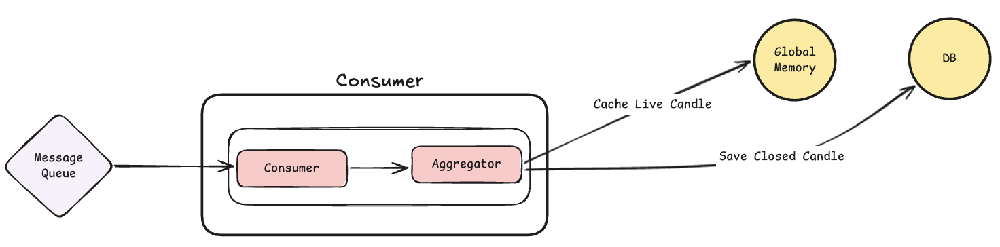
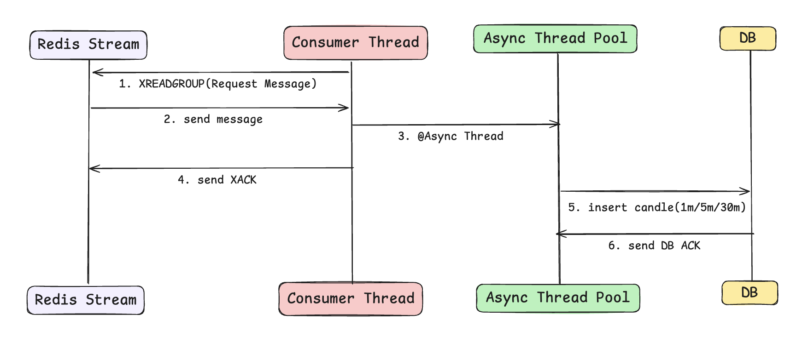

- 환경: AWS T2.micro
- 메모리: 512MB
- DB: HikariCP (default)
- 목표: 1분/5분/30분 캔들, 심볼(종목) 100개 확장 고려

안녕하세요 오늘은 실시간성을 위해 캔들을 어떻게 저장해야 할까에 대해 이야기 해보려고 합니다.

제가 어떤 방식으로 캔들을 저장하고 있었는지 소개하기에 앞서, 캔들이 저장되는 흐름에 대해 먼저 말씀드리려 합니다.
흐름은 다음과 같습니다.

--- 

## Consumer 모듈 캔들 데이터 저장 흐름



1. Collector 모듈이 외부 API 를 통해 Tick 데이터를 받은 후, **그림과 같은 MessageQueue에 데이터를 집어넣습니다.**
2. Consumer 모듈이 MessageQueue에서 데이터를 꺼내와서 Aggregate 모듈을 통해 데이터를 집계합니다.
3. Aggregate 모듈은 1분, 5분, 30분 캔들을 집계합니다.
4. 집계된 캔들은 DB에 저장됩니다.

----

그렇다면 이러한 흐름 속에서 캔들 데이터는 구체적으로 어떻게 저장되고 있었을까요?

## 동기 캔들 데이터 저장 방식

원래 캔들 데이터 저장 방식은 다음과 같았습니다. 


1. Consumer Thread가 MessageQueue에서 데이터를 꺼내와서 1m/5m/30m 캔들을 집계합니다.
2. 집계된 캔들은 DB에 저장됩니다.
3. 해당 로직은 동기적으로 동작합니다.


위의 다이어그램에서 알 수 있듯이, 기존 방식의 가장 큰 문제는 **Consumer Thread가 DB 응답을 기다리는 동안 아무것도 하지 못하는 상태**가 된다는 점입니다.

1m/5m/30m 모두 하나의 Consumer Thread가 처리하기 때문에 1m 캔들 처리 중 DB 응답이 지연되면 5m, 30m 캔들 처리도 지연되는 구조이죠.

더군다나 이 상태에서 1h/24h 등 캔들을 확장하게 되면 현재가 처리 지연이 더 심각해질 수 있습니다.

빠르게 현재가 데이터를 사용자에게 보여줘야하는 차트 서비스에 있어서 해당 부분은 상당히 큰 문제라는 것을 알 수 있죠..

그래서 저는 이러한 문제를 해결하기 위해 데이터 저장을 비동기 방식으로 변경했습니다.

---

## 비동기 캔들 데이터 저장 방식

흐름은 다음과 같습니다.



1. Consumer Thread가 MessageQueue에서 데이터를 꺼내와서 1m/5m/30m 캔들을 집계합니다.
2. 집계된 캔들을 DB 에 저장할 때 **DB 전용 스레드에 비동기로 저장을 요청**합니다.
3. Consumer Thread 는 DB 전용 스레드의 응답을 기다리지 않고 **즉시 다음 작업을 수행(다음 틱 읽기)**합니다.
4. DB 전용 스레드는 데이터 저장을 수행하며, **모든 인터벌(1m/5m/30m)의 저장이 성공적으로 완료된 시점에 Redis에 확인 응답(XACK)을 전송**합니다.

이렇듯, 비동기 방식으로 변경함으로써 Consumer Thread의 차단을 막아 **실시간성을 확보**함과 동시에, 실제 ACK는 저장이 끝난 뒤에 날림으로써 **데이터 유실(At-least-once 보장)까지 잡은 완벽한 구조**를 완성했습니다.

비동기 방식의 전체적인 흐름은 여기까지이고, 이제부터는 스레드 풀을 어떻게 설정했는지, 비동기 저장이 실패했을 때 어떻게 처리했는지에 대해 설명드리겠습니다.

---

## 비동기 저장 방식의 구현

우선, 스레드 풀을 어떻게 설정했는지에 대해 설명하려면 DB Connection Pool에 대해 먼저 설명드려야 합니다.
(캔들 저장이 I/O 중심 작업이기에 먼저 설명드립니다.)

### DB Connection Pool

[DB connection pool image]

기본적으로 DB Connection Pool은 DB에 연결할 수 있는 Connection 객체들을 미리 생성해놓고 필요할 때마다 빌려쓰는 구조입니다.(DB에 연결하는 비용이 비싸기 때문입니다.)

그리고 위의 그림처럼 Connection Pool 은 idle, active, 요청이 온 스레드를 관리하고, Connection 객체들은 두 가지 상태를 가지게 됩니다.

* 참고로 Spring Boot는 기본적으로 HikariCP를 사용하고, HikariCP는 기본적으로 10개의 Connection을 생성합니다.

그리고 각 스레드들은 Connection Pool 과 다음과 같은 방식으로 동작합니다.

[thread db connection]

그림을 보게 되면, Connection 과 Thread 는 1:1로 매핑되어 동작한다는 것을 알 수 있습니다.

그렇다면 이제는 알 수 있습니다. Thread 가 아무리 많아도, DB와의 연결은 Connection Pool 의 Connection 개수보다 많을 수는 없습니다.

이러한 기본적인 사실과 함께 스레드 풀을 어떻게 설정했는지에 대해 설명드리겠습니다.

### 스레드 풀 설정

아래는 제가 설정한 스레드 풀 설정입니다.

```java
@Bean(name = "dbPersistExecutor")
public Executor dbPersistExecutor() {
    ThreadPoolTaskExecutor executor = new ThreadPoolTaskExecutor();

    executor.setCorePoolSize(properties.corePoolSize());      // 기본 유지 스레드 수 (3)
    executor.setMaxPoolSize(properties.maxPoolSize());        // 최대 스레드 수 (5)
    executor.setQueueCapacity(properties.queueCapacity());    // 대기 큐 크기 (500)
    executor.setKeepAliveSeconds(properties.keepAliveSeconds()); // 유휴 스레드 대기 시간
    executor.setAllowCoreThreadTimeOut(true);                 // Core 스레드도 유휴 시 반납 (자원 효율화)
    executor.setThreadNamePrefix(properties.threadNamePrefix());
    executor.setRejectedExecutionHandler(new CallerRunsPolicy()); // 거절 정책: 호출한 스레드에서 직접 실행
    
    executor.initialize();
    return executor;
}
```

먼저 저는 AWS T2.micro 환경에서 CPU 1개, 512MB 메모리를 사용하고 있었고, DB는 HikariCP를 사용하고 있습니다.
그리고 심볼(종목)은 100개 정도로 확장할 생각도 있습니다.

이러한 환경에서 스레드 풀을 어떻게 설정했는지에 대해 설명드리겠습니다.


가장 먼저 해당 작업이 CPU 중심 작업인지, I/O 중심 작업인지에 대해 검토했습니다.
캔들 저장만 해주기 때문에 I/O 중심 작업으로 판단했습니다.


I/O 중심 작업의 경우, CPU 코어 수보다 많은 스레드를 설정하는 것이 효율적입니다.
I/O 작업을 비동기로 처리하였을 때, CPU가 다른 작업을 할 수 있기 때문입니다.
다만 위에서 설명드렸듯이, 스레드를 많이 생성했다고 해서 DB와의 Connection 을 무한정으로 늘릴 수는 없습니다. DB Connection Pool 개수가 정해져 있기 때문입니다. (즉, 10개 보다 많이 스레드를 설정해주면 낭비입니다.)


## 스레드 생성 전략 ## 

그리고 스레드 생성 전략은 고정 스레드 풀 방식으로 결정했습니다.(고정된 스레드 개수를 끝까지 가져가는 전략)


이유는 다음과 같습니다.


1. 예상되는 작업 요청량을 정확히 알고 있었습니다.(30분당 최대 300개 요청)

자바의 ThreadPoolExcutor는 큐가 꽉 차야지만 스레드를 한개씩 생성합니다.
만일 큐를 다 채우지 못하면 처음 설정된 Core 스레드(최소한의 스레드)만 동작 -> 처리지연으로 이어집니다.
만일 큐를 다 채워진다면 -> 스레드 생성 비용이 생깁니다.
따라서, 예상되는 작업 요청량을 알고 있는 상황에서는 고정 스레드 풀이 효율적이라고 생각했습니다.


2. 무엇보다 T2.micro 환경에서, 리소스 낭비를 줄이기 + 안정성을 유지 가능하다고 판단했습니다.

만일 캐시 스레드 풀 전략을 선택했다면, 300개 요청이 들어왔을 때 최악의 경우 300개의 스레드를 모두 생성하게 됩니다.(캐시 스레드 풀 방식은 큐를 사용하지 않습니다.) -> OOM 발생 가능하다고 판단했습니다.
따라서 스레드를 고정으로 생성 + 큐를 이용하여 OOM 발생을 방지했습니다.
또한, setAllowCoreThreadTimeOut(true) 설정을 통해 쓰지 않는 스레드는 반납하는 정책을 통해 자원의 효율성을 높였습니다.


++ 추가로 고정 스레드 풀 전략과는 별개로 스레드 관리 + 과부하에 대한 방지를 위해 ThreadNamePrefix + CallerRunsPolicy 설정을 통해 안정성을 확보했습니다.


## 스레드 개수 할당##

그렇다면 스레드 개수는 몇 개로 생성해줘야 할까요? 

해당 부분은 실제 환경에서 테스트를 통해 정해줬습니다.

테스트 코드는 다음과 같습니다.

```java
@Test
@DisplayName("100개 종목 동시 마감(300건 저장) 시나리오 성능 측정")
void monitorAsyncSpikeLoad() throws InterruptedException {
    // 1. 300개의 스파이크 부하 준비 (100개 종목 x 캔들 3종)
    int totalRequests = 300;
    
    // 2. DB I/O 지연 시뮬레이션 (50ms 지연 Mocking)
    doAnswer(invocation -> {
        Thread.sleep(50); // 실제 RDS 환경의 평균 지연 시간 가정
        return null;
    }).when(ohlcService).save(any());

    StopWatch submitWatch = new StopWatch();
    submitWatch.start();

    // 3. 비동기 작업 300개 투입 (Submission)
    for (int i = 0; i < totalRequests; i++) {
        dbPersistService.persistAsync(new OhlcData());
    }
    submitWatch.stop();

    log.info(">>> [제출 완료] 메인 스레드 요청 투입 소요 시간: {}ms", submitWatch.getTotalTimeMillis());

    // 4. 모든 작업이 완료(Queue Drain)될 때까지 대기 및 모니터링
    StopWatch drainWatch = new StopWatch();
    drainWatch.start();
    while (executor.getActiveCount() > 0 || executor.getThreadPoolExecutor().getQueue().size() > 0) {
        Thread.sleep(200); // 200ms 간격으로 상태 체크
    }
    drainWatch.stop();

    log.info(">>> [모든 작업 완료] 총 대기열 소진 시간: {}ms", drainWatch.getTotalTimeMillis());
}
```

우선 300개의 데이터를 넣어주는 테스트를 진행했습니다.


CountDownLatch를 통해 비동기 스레드의 작업 시간을 측정해줬고,

Thread.sleep(50) 즉 50ms 의 delay 를 통해 실제 DB 환경의 지연(최악의 상황)을 반영하도록 해봤습니다.


결과는 다음과 같았습니다.

스레드 1개인 경우

	스레드 3개인 경우


스레드 5개인 경우

	스레드 7개인 경우


그리고 결과적으로 5개의 스레드를 비동기 스레드로 할당해줬습니다!


우선, 차트 서비스 특성상 차트를 조회하는 API 요청이 정~말 많이 들어올 것 같았습니다. 그래서 API를 위한 스레드를 적어도 절반은 할당해주어야 한다고 생각했습니다.


두 번째로, 300개의 데이터를 처리하는데 약 3.2초는 충분하다고 생각했습니다. 30분 마다 300개의 요청이 고정으로 들어오지만 이게 최대이고, 이후 31분 데이터 저장 요청이 들어오기까지 약 56.6초라는 여유가 있다고 판단했습니다.


(물론 해당 부분은 실 사용자를 받거나 부하테스트를 통해 이 부분은 다시 조율이 필요할 것 같습니다. 필요에 따라 현재 환경을 고려하여 DB connection pool을 늘릴 필요도 있을 것 같습니다.)

## 비동기 방식과 동기 방식의 차이 비교

단순히 DB 저장 속도가 빨라지는 것이 목적이 아닙니다. 핵심 논점은 **"30분마다 발생하는 대량의 마감 부하(300건)가 발생했을 때, 그 뒤에 즉시 따라오는 실시간 틱 데이터 처리가 방해받지 않는가?"**를 증명하는 것입니다.

### **📊 부하 중첩 시뮬레이션 테스트 (마감 300건 + 실시간 1,000건)**

30분 정각에 1분/5분/30분 캔들이 동시에 마감되는 상황(Spike Overlap)을 시뮬레이션하여, 메인 Consumer 스레드가 전체 작업을 완료하는 데 걸리는 시간을 측정했습니다.

```java
@Test
@DisplayName("마감 300건 + 일반 틱 1,000건 발생 시 실시간성 지연 측정")
void simulateSpikeLoadPersistence() throws InterruptedException {
    // 1. 동기(Sync) 방식 시뮬레이션
    watch.start("Sync_Spike");
    for (int i = 0; i < 300; i++) {
        ohlc1mService.applyAndSave(...); // 50ms 블로킹 발생
    }
    for (int i = 0; i < 1000; i++) {
        // 실시간 가격 브로드캐스팅 로직 
    }
    watch.stop();

    // 2. 비동기(Async) 방식 시뮬레이션
    watch.start("Async_Spike");
    for (int i = 0; i < 300; i++) {
        dbPersistService.persistClosedCandleAsync(...); 
    }
    for (int i = 0; i < 1000; i++) {
        // 실시간 가격 브로드캐스팅 로직
    }
    watch.stop();
}
```

테스트 시나리오는 다음과 같았습니다. 

총 1000 Tick 처리
RedisStream 과 같이 데이터 순차 처리를 위해 for 문 사용
데이터를 읽어오기 전, 30분이라는 상황을 가정하고 300개의 데이터 저장 수행


테스트 결과


엄청난 차이입니다.


동기 방식의 경우 DB 저장을 위해 스레드가 blocking 되면서, 현재가 데이터를 읽어오는데 지연이 생겼습니다.

하지만 비동기 방식의 경우 DB 저장을 위한 스레드에 해당 작업을 맡기기 때문에 현재가 테이터를 빠르게 읽어올 수 있습니다.


결과적으로 비동기로 전환한 것은 올바른 판단이었고, 사용자에게 데이터를 실시간으로 전달할 수 있게 되었습니다!


그렇다면 이렇게 구현한 비동기 방식은 항상 올바르게 작동하는 것일까요? 정답은 **"절대 아닙니다."**

비동기 처리는 메인 스레드의 통제를 벗어나 별도의 스레드 풀에서 동작하기 때문에, 성능을 얻은 대신 **데이터 정합성(Consistency) 문제**라는 새로운 숙제를 던져줍니다.

---

## 데이터 정합성 보장 전략(Lock & Retry)
데이터 정합성을 보장하기 위한 전략을 설명드리기 전에, 어떤 상황에서 정합성이 깨지게 되는지 설명드리고자 합니다.

정합성 보장이 안되는 시나리오 - Race Condition
## 시나리오1: Redis Stream의 At-least-once 특성 ## 

기본적으로 Redis Stream은 메시지의 유실을 막기 위해 XACK 메시지를 못받게 되면, 해당 데이터를 Pending Entries List(PEL)에 저장하여 관리합니다. (여기에 저장해놨다가 꼭 한번은 읽을 수 있게 관리합니다.)


이후 Consumer 가 PEL에 있는 메시지를 다시 읽는다면 다음과 같은 상황이 일어날 수 있습니다.


PEL race condition


처음 읽었던 데이터의 DB 저장 작업이 진행중인 상황에서, PEL에서 읽어온 똑같은 데이터 DB 작업이 겹치게 되니 Race Condition이 발생합니다.(물론 이런 경우는 잘 없습니다.)


## 시나리오2: Late-tick 처리 ## 

두 번째로 Late-tick 을 처리하며 race condition이 발생할 수 있습니다.


(1m 기준)

현재 캔들 저장 로직은 12:00 분봉을 12:01:XX(다음 분봉) 데이터가 들어오는 순간 마감(Closed)으로 판단되어 저장을 시작합니다.

이후 늦게 들어오는 12:00분 데이터에 대해서는 바로바로 업데이트를 해줍니다.


**현재 지연 데이터(Late-tick) 보정 원리** 


캔들이 마감되었다고 해서 바로 버려지는 것이 아니라, 잠시 동안 메모리 버퍼(recentlyClosed)에 머뭅니다. 이 짧은 찰나에 들어오는 지연 데이터는 다음과 같은 과정을 거쳐 DB에 반영됩니다.


1. 메모리 갱신: 버퍼에서 해당 12:00 캔들을 꺼내, 지연 데이터의 거래량을 합산하고 고가/저가/종가를 재계산합니다.

2. 전체 덮어쓰기: 갱신된 "최종 캔들 데이터"를 들고 DB로 가서 해당 행(Row)을 통째로 덮어씌웁니다.


late tick race condition


아주 짧은 시간 안에 late tick 이 들어오게 되면 그림과 같이 같은 캔들에 한하여 race condition 이 일어날 수 있습니다.

## Optimistic Lock


## 유니크 인덱스 적용


일단 가장 먼저 컬럼에 인덱스를 적용해줬습니다.


CONSTRAINT uk_ohlc_1m_symbol_bucket UNIQUE (symbol_id, bucket_time)


해당 종목의 id 와 해당 시간대를 기준으로 유니크 인덱스를 생성해줬습니다.


1. 이제 같은 row 에 한해서, insert